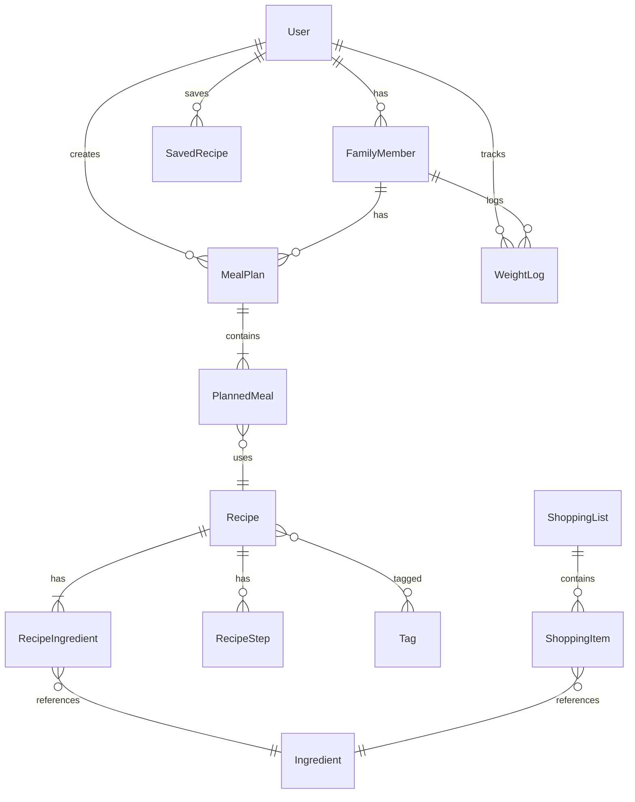

# NutriPlanIT - Data Models

> **Version:** 1.0
> **Last Updated:** 2025-12-28

---

## Entity Relationship Diagram



---

## 1. User (Auth: Supabase)

> Gestito da Supabase Auth. Sincronizziamo solo i campi necessari.

| Campo | Tipo | Note |
|-------|------|------|
| `id` | UUID (PK) | Da Supabase Auth |
| `email` | string | Da Supabase Auth |
| `display_name` | string? | Opzionale |
| `locale` | enum | `it` \| `en` |
| `is_premium` | boolean | Default false |
| `premium_until` | timestamp? | Scadenza premium |
| `created_at` | timestamp | |
| `updated_at` | timestamp | |

---

## 2. FamilyMember

> Ogni membro della famiglia con i propri dati fisici e obiettivi.

| Campo | Tipo | Note |
|-------|------|------|
| `id` | UUID (PK) | |
| `user_id` | UUID (FK → User) | Owner dell'account |
| `name` | string | Es: "Papà", "Marco" |
| `is_primary` | boolean | Il primo membro = l'utente stesso |
| `birth_year` | integer | Per calcolo età |
| `sex` | enum | `male` \| `female` |
| `height_cm` | integer | Altezza in cm |
| `weight_kg` | decimal(5,2) | Peso attuale in kg |
| `activity_level` | enum | `sedentary` \| `light` \| `moderate` \| `active` \| `very_active` |
| `goal` | enum | `cut` \| `maintain` \| `bulk` |
| `calorie_adjustment` | integer | Es: -400 (cut) o +300 (bulk) |
| `tdee` | integer | Calcolato: BMR × activity |
| `target_kcal` | integer | TDEE + adjustment |
| `macro_protein_pct` | integer | Default 30 |
| `macro_carb_pct` | integer | Default 40 |
| `macro_fat_pct` | integer | Default 30 |
| `snacks_enabled` | boolean | Default false (true per bulk) |
| `created_at` | timestamp | |
| `updated_at` | timestamp | |

### Computed Fields (non salvati)
```typescript
// Calcolo TDEE
const bmr = sex === 'male'
  ? 10 * weight_kg + 6.25 * height_cm - 5 * age + 5
  : 10 * weight_kg + 6.25 * height_cm - 5 * age - 161;

const activityMultipliers = {
  sedentary: 1.2,
  light: 1.375,
  moderate: 1.55,
  active: 1.725,
  very_active: 1.9
};

const tdee = Math.round(bmr * activityMultipliers[activity_level]);
const target_kcal = tdee + calorie_adjustment;
```

---

## 3. Recipe

| Campo | Tipo | Note |
|-------|------|------|
| `id` | UUID (PK) | |
| `name_it` | string | Nome italiano |
| `name_en` | string | Nome inglese |
| `slug` | string | URL-friendly, unique |
| `description_it` | text | Descrizione IT |
| `description_en` | text | Descrizione EN |
| `category` | enum | `breakfast` \| `lunch` \| `dinner` \| `snack` |
| `image_url` | string | Cloudinary URL |
| `prep_time_min` | integer | Tempo preparazione |
| `cook_time_min` | integer | Tempo cottura |
| `total_time_min` | integer | prep + cook |
| `servings` | integer | Numero porzioni base |
| `difficulty` | enum | `easy` \| `medium` \| `hard` |
| `kcal_per_100g` | integer | Calorie per 100g |
| `kcal_per_serving` | integer | Calorie per porzione |
| `protein_per_100g` | decimal(5,2) | Proteine g |
| `carbs_per_100g` | decimal(5,2) | Carboidrati g |
| `fat_per_100g` | decimal(5,2) | Grassi g |
| `fiber_per_100g` | decimal(5,2)? | Fibre g (opzionale) |
| `serving_weight_g` | integer | Peso in grammi di 1 porzione |
| `is_published` | boolean | Visibile agli utenti |
| `created_at` | timestamp | |
| `updated_at` | timestamp | |

### Campi v2.0 (predisposti ma non usati MVP)
| Campo | Tipo | Note |
|-------|------|------|
| `cost_level` | enum? | `low` \| `medium` \| `high` |
| `video_url` | string? | YouTube/Vimeo |
| `audio_url` | string? | Podcast |

---

## 4. Tag

> Tag flessibili per diete e restrizioni.

| Campo | Tipo | Note |
|-------|------|------|
| `id` | UUID (PK) | |
| `slug` | string | `gluten-free`, `vegan`, etc. |
| `name_it` | string | "Senza glutine" |
| `name_en` | string | "Gluten-free" |
| `icon` | string? | Emoji o icon name |

### Tag predefiniti (v2.0)
- `gluten-free` - Senza glutine
- `lactose-free` - Senza lattosio
- `vegan` - Vegano
- `vegetarian` - Vegetariano
- `mediterranean` - Dieta mediterranea
- `low-carb` - Low carb
- `high-protein` - Alto contenuto proteico

---

## 5. RecipeTag (Many-to-Many)

| Campo | Tipo | Note |
|-------|------|------|
| `recipe_id` | UUID (FK → Recipe) | PK |
| `tag_id` | UUID (FK → Tag) | PK |

---

## 6. Ingredient

> Ingredienti master con dati nutrizionali da USDA.

| Campo | Tipo | Note |
|-------|------|------|
| `id` | UUID (PK) | |
| `usda_fdc_id` | string? | ID USDA FoodData Central |
| `name_it` | string | "Pasta di semola" |
| `name_en` | string | "Semolina pasta" |
| `category` | string? | "Cereali", "Verdure", etc. |
| `kcal_per_100g` | integer | |
| `protein_per_100g` | decimal(5,2) | |
| `carbs_per_100g` | decimal(5,2) | |
| `fat_per_100g` | decimal(5,2) | |
| `fiber_per_100g` | decimal(5,2)? | |
| `cooked_weight_factor` | decimal(3,2) | Es: 2.1 (pasta cruda → cotta) |
| `default_unit` | string | "g", "ml", "pz" |
| `created_at` | timestamp | |

---

## 7. RecipeIngredient

> Ingredienti di una ricetta con quantità.

| Campo | Tipo | Note |
|-------|------|------|
| `id` | UUID (PK) | |
| `recipe_id` | UUID (FK → Recipe) | |
| `ingredient_id` | UUID (FK → Ingredient) | |
| `quantity` | decimal(7,2) | Quantità |
| `unit` | string | "g", "ml", "pz", "cucchiaio" |
| `is_optional` | boolean | Per guarnizioni |
| `notes_it` | string? | "peso sgocciolato" |
| `notes_en` | string? | "drained weight" |
| `order` | integer | Ordine visualizzazione |

---

## 8. RecipeStep

> Passaggi di preparazione.

| Campo | Tipo | Note |
|-------|------|------|
| `id` | UUID (PK) | |
| `recipe_id` | UUID (FK → Recipe) | |
| `step_number` | integer | 1, 2, 3... |
| `instruction_it` | text | Testo italiano |
| `instruction_en` | text | Testo inglese |
| `image_url` | string? | v2.0: foto step |

---

## 9. MealPlan

> Piano settimanale per un membro della famiglia.

| Campo | Tipo | Note |
|-------|------|------|
| `id` | UUID (PK) | |
| `user_id` | UUID (FK → User) | Owner |
| `family_member_id` | UUID (FK → FamilyMember) | Per chi è il piano |
| `week_start` | date | Lunedì della settimana |
| `target_kcal_weekly` | integer | target_kcal × 7 |
| `actual_kcal_weekly` | integer | Somma effettiva |
| `status` | enum | `draft` \| `active` \| `completed` |
| `created_at` | timestamp | |
| `updated_at` | timestamp | |

---

## 10. PlannedMeal

> Singolo pasto pianificato.

| Campo | Tipo | Note |
|-------|------|------|
| `id` | UUID (PK) | |
| `meal_plan_id` | UUID (FK → MealPlan) | |
| `recipe_id` | UUID (FK → Recipe) | |
| `day` | integer | 1-7 (Lun-Dom) |
| `meal_type` | enum | `breakfast` \| `lunch` \| `dinner` \| `snack_am` \| `snack_pm` |
| `portion_grams` | integer | Porzione personalizzata |
| `portion_kcal` | integer | Calorie della porzione |
| `is_completed` | boolean | Pasto consumato |
| `created_at` | timestamp | |

---

## 11. ShoppingList

> Lista della spesa settimanale.

| Campo | Tipo | Note |
|-------|------|------|
| `id` | UUID (PK) | |
| `user_id` | UUID (FK → User) | |
| `meal_plan_id` | UUID (FK → MealPlan)? | Opzionale, può essere manuale |
| `week_start` | date | |
| `name` | string | "Spesa settimana 1 Gen" |
| `created_at` | timestamp | |

---

## 12. ShoppingItem

| Campo | Tipo | Note |
|-------|------|------|
| `id` | UUID (PK) | |
| `shopping_list_id` | UUID (FK → ShoppingList) | |
| `ingredient_id` | UUID (FK → Ingredient)? | Null se item manuale |
| `name` | string | Nome ingrediente o custom |
| `quantity` | decimal(7,2) | |
| `unit` | string | |
| `is_checked` | boolean | Spuntato |
| `order` | integer | |

---

## 13. WeightLog

> Storico peso per tracking progressi.

| Campo | Tipo | Note |
|-------|------|------|
| `id` | UUID (PK) | |
| `user_id` | UUID (FK → User) | |
| `family_member_id` | UUID (FK → FamilyMember) | |
| `date` | date | |
| `weight_kg` | decimal(5,2) | |
| `notes` | string? | |
| `created_at` | timestamp | |

---

## 14. SavedRecipe

> Ricette salvate dall'utente (preferiti).

| Campo | Tipo | Note |
|-------|------|------|
| `user_id` | UUID (FK → User) | PK |
| `recipe_id` | UUID (FK → Recipe) | PK |
| `saved_at` | timestamp | |

---

## 15. BlogPost (v2.0 - struttura base)

| Campo | Tipo | Note |
|-------|------|------|
| `id` | UUID (PK) | |
| `slug` | string | |
| `title_it` | string | |
| `title_en` | string | |
| `content_it` | text | Markdown |
| `content_en` | text | Markdown |
| `category` | enum | `exercise` \| `health` \| `beauty` \| `nutrition` |
| `image_url` | string | |
| `is_published` | boolean | |
| `published_at` | timestamp? | |
| `created_at` | timestamp | |

---

## Indici Consigliati

```sql
-- Performance queries frequenti
CREATE INDEX idx_recipe_category ON Recipe(category);
CREATE INDEX idx_recipe_published ON Recipe(is_published);
CREATE INDEX idx_planned_meal_plan ON PlannedMeal(meal_plan_id);
CREATE INDEX idx_meal_plan_user_week ON MealPlan(user_id, week_start);
CREATE INDEX idx_weight_log_member ON WeightLog(family_member_id, date);
CREATE INDEX idx_family_member_user ON FamilyMember(user_id);
```

---

## Note Implementative

1. **UUID vs Auto-increment:** Usa UUID per sync offline e sicurezza
2. **Timestamps:** Sempre `created_at` e `updated_at` per audit
3. **Soft Delete:** Non implementato MVP, aggiungi `deleted_at` se necessario
4. **Drizzle ORM:** Genera schema TypeScript da queste definizioni
5. **Zod:** Ogni tabella avrà uno schema Zod per validazione
