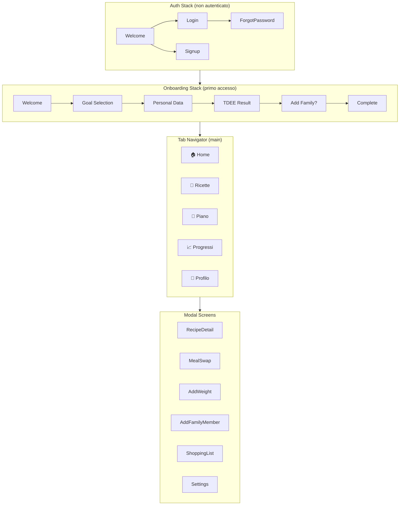

# NutriPlanIT - Screen Flow

> **Version:** 1.0
> **Last Updated:** 2025-12-28

---

## Navigation Structure



---

## Tab Bar

| Tab | Icona | Schermata | Scopo |
|-----|-------|-----------|-------|
| Home | 🏠 | `HomeScreen` | Dashboard principale |
| Ricette | 🍳 | `RecipesScreen` | Esplora catalogo ricette |
| Piano | 📅 | `PlanScreen` | Piano settimanale |
| Progressi | 📈 | `ProgressScreen` | Tracking peso e misure |
| Profilo | 👤 | `ProfileScreen` | Impostazioni e famiglia |

---

## 1. Auth Stack

### 1.1 WelcomeScreen
```
┌─────────────────────────────────┐
│                                 │
│         [Logo NutriPlanIT]      │
│                                 │
│    "Piani alimentari per       │
│     tutta la famiglia"          │
│                                 │
│  ┌───────────────────────────┐  │
│  │      Inizia ora           │  │
│  └───────────────────────────┘  │
│                                 │
│  ┌───────────────────────────┐  │
│  │   Ho già un account       │  │
│  └───────────────────────────┘  │
│                                 │
│         ── oppure ──            │
│                                 │
│  [G] Continua con Google       │
│  [🍎] Continua con Apple        │
│                                 │
└─────────────────────────────────┘
```

### 1.2 LoginScreen
- Email + Password
- Link "Password dimenticata?"
- Link "Non hai un account? Registrati"

### 1.3 SignupScreen
- Email + Password + Conferma password
- Checkbox termini e privacy
- Link "Hai già un account? Accedi"

---

## 2. Onboarding Stack (primo accesso)

### 2.1 OnboardingGoalScreen
```
┌─────────────────────────────────┐
│  ← Indietro           1/4      │
├─────────────────────────────────┤
│                                 │
│    Qual è il tuo obiettivo?     │
│                                 │
│  ┌───────────────────────────┐  │
│  │  🔥 Perdere peso          │  │
│  │     Deficit calorico       │  │
│  └───────────────────────────┘  │
│                                 │
│  ┌───────────────────────────┐  │
│  │  ⚖️ Mantenere il peso     │  │
│  │     Equilibrio calorico    │  │
│  └───────────────────────────┘  │
│                                 │
│  ┌───────────────────────────┐  │
│  │  💪 Aumentare massa       │  │
│  │     Surplus calorico       │  │
│  └───────────────────────────┘  │
│                                 │
└─────────────────────────────────┘
```

### 2.2 OnboardingProfileScreen
```
┌─────────────────────────────────┐
│  ← Indietro           2/4      │
├─────────────────────────────────┤
│                                 │
│      I tuoi dati                │
│                                 │
│  Sesso:  ○ Uomo   ○ Donna      │
│                                 │
│  Anno di nascita:               │
│  ┌─────────────────────────┐    │
│  │  1990                    │    │
│  └─────────────────────────┘    │
│                                 │
│  Altezza (cm):                  │
│  ┌─────────────────────────┐    │
│  │  175                     │    │
│  └─────────────────────────┘    │
│                                 │
│  Peso attuale (kg):             │
│  ┌─────────────────────────┐    │
│  │  80                      │    │
│  └─────────────────────────┘    │
│                                 │
│  Livello di attività:           │
│  ┌─────────────────────────┐    │
│  │  Moderato            ▼  │    │
│  └─────────────────────────┘    │
│                                 │
│  ┌───────────────────────────┐  │
│  │        Continua           │  │
│  └───────────────────────────┘  │
└─────────────────────────────────┘
```

### 2.3 OnboardingTDEEScreen
```
┌─────────────────────────────────┐
│  ← Indietro           3/4      │
├─────────────────────────────────┤
│                                 │
│      Il tuo fabbisogno          │
│                                 │
│     ┌─────────────────┐         │
│     │                 │         │
│     │     2.400       │         │
│     │   kcal/giorno   │         │
│     │                 │         │
│     └─────────────────┘         │
│                                 │
│  Con obiettivo "Perdere peso":  │
│                                 │
│     ┌─────────────────┐         │
│     │     2.000       │ Target  │
│     │   kcal/giorno   │         │
│     └─────────────────┘         │
│                                 │
│  Deficit: -400 kcal             │
│                                 │
│  ┌───────────────────────────┐  │
│  │ ⚙️ Personalizza macro     │  │
│  └───────────────────────────┘  │
│                                 │
│  ┌───────────────────────────┐  │
│  │        Continua           │  │
│  └───────────────────────────┘  │
└─────────────────────────────────┘
```

### 2.4 OnboardingFamilyScreen
```
┌─────────────────────────────────┐
│  ← Indietro           4/4      │
├─────────────────────────────────┤
│                                 │
│  Cucini per la tua famiglia?    │
│                                 │
│  Aggiungi i membri per avere    │
│  porzioni personalizzate per    │
│  ognuno.                        │
│                                 │
│  ┌───────────────────────────┐  │
│  │  👤 Tu                    │  │
│  │     2.000 kcal            │  │
│  └───────────────────────────┘  │
│                                 │
│  ┌───────────────────────────┐  │
│  │  + Aggiungi membro        │  │
│  └───────────────────────────┘  │
│                                 │
│         oppure                  │
│                                 │
│  ┌───────────────────────────┐  │
│  │  Salta per ora →          │  │
│  └───────────────────────────┘  │
│                                 │
│  ┌───────────────────────────┐  │
│  │     Inizia a pianificare  │  │
│  └───────────────────────────┘  │
└─────────────────────────────────┘
```

---

## 3. Tab Screens

### 3.1 HomeScreen
```
┌─────────────────────────────────┐
│  Ciao Marco! 👋                │
├─────────────────────────────────┤
│                                 │
│  ┌─────────────────────────┐    │
│  │ 📅 Piano di questa      │    │
│  │    settimana            │    │
│  │ ────────────────────    │    │
│  │ Oggi: 1.850/2.000 kcal  │    │
│  │ Settimana: 12.400/14.000│    │
│  │                         │    │
│  │ [Visualizza piano →]    │    │
│  └─────────────────────────┘    │
│                                 │
│  Prossimo pasto                 │
│  ┌─────────────────────────┐    │
│  │ 🍝 Pranzo               │    │
│  │ Pasta al pomodoro       │    │
│  │ 450 kcal · 85g porzione │    │
│  │                         │    │
│  │ [Vedi ricetta] [Swap]   │    │
│  └─────────────────────────┘    │
│                                 │
│  📈 Trend peso                  │
│  ┌─────────────────────────┐    │
│  │  [Grafico mini]         │    │
│  │  -0.5 kg questa sett.   │    │
│  └─────────────────────────┘    │
│                                 │
│  📰 Dal blog                    │
│  ┌────────┐ ┌────────┐          │
│  │ Art 1  │ │ Art 2  │          │
│  └────────┘ └────────┘          │
│                                 │
└─────────────────────────────────┘
│ 🏠  │  🍳  │  📅  │  📈  │  👤  │
└─────────────────────────────────┘
```

### 3.2 RecipesScreen
```
┌─────────────────────────────────┐
│  Ricette                        │
├─────────────────────────────────┤
│  ┌─────────────────────────┐    │
│  │ 🔍 Cerca ricetta...      │    │
│  └─────────────────────────┘    │
│                                 │
│  [Tutte][Colazione][Pranzo]     │
│  [Cena][Snack][❤️ Salvate]     │
│                                 │
│  ┌──────────┐ ┌──────────┐      │
│  │  [img]   │ │  [img]   │      │
│  │ Pasta    │ │ Uova     │      │
│  │ pomodoro │ │ ripiene  │      │
│  │ 350 kcal │ │ 70 kcal  │      │
│  │ ⏱ 25min  │ │ ⏱ 25min  │      │
│  └──────────┘ └──────────┘      │
│                                 │
│  ┌──────────┐ ┌──────────┐      │
│  │  [img]   │ │  [img]   │      │
│  │ ...      │ │ ...      │      │
│  └──────────┘ └──────────┘      │
│                                 │
└─────────────────────────────────┘
```

### 3.3 PlanScreen
```
┌─────────────────────────────────┐
│  Piano Settimanale              │
│  ◀ 30 Dic - 5 Gen ▶            │
├─────────────────────────────────┤
│  Per: [Marco ▼]                │
│                                 │
│  ┌─────────────────────────┐    │
│  │ LUN 30                  │    │
│  │ ──────────────────────  │    │
│  │ ☀️ Colazione: Yogurt    │    │
│  │ 🍝 Pranzo: Pasta tonno  │    │
│  │ 🌙 Cena: Pollo grigli.  │    │
│  │                         │    │
│  │ Totale: 1.920 kcal ✓    │    │
│  └─────────────────────────┘    │
│                                 │
│  ┌─────────────────────────┐    │
│  │ MAR 31                  │    │
│  │ ...                     │    │
│  └─────────────────────────┘    │
│                                 │
│  ┌───────────────────────────┐  │
│  │  🔄 Rigenera piano       │  │
│  └───────────────────────────┘  │
│                                 │
│  ┌───────────────────────────┐  │
│  │  🛒 Lista della spesa    │  │
│  └───────────────────────────┘  │
└─────────────────────────────────┘
```

### 3.4 ProgressScreen
```
┌─────────────────────────────────┐
│  Progressi                      │
├─────────────────────────────────┤
│  Per: [Marco ▼]                │
│                                 │
│  ┌─────────────────────────┐    │
│  │ Peso attuale            │    │
│  │ ┌─────────────────┐     │    │
│  │ │     78.5 kg     │     │    │
│  │ └─────────────────┘     │    │
│  │ -1.5 kg dal 1 Dic       │    │
│  └─────────────────────────┘    │
│                                 │
│  ┌─────────────────────────────┐│
│  │                             ││
│  │    [Grafico peso]           ││
│  │    Ultimi 30 giorni         ││
│  │                             ││
│  └─────────────────────────────┘│
│                                 │
│  Storico                        │
│  ┌─────────────────────────┐    │
│  │ 28 Dic: 78.5 kg         │    │
│  │ 21 Dic: 79.2 kg         │    │
│  │ 14 Dic: 79.8 kg         │    │
│  │ ...                     │    │
│  └─────────────────────────┘    │
│                                 │
│  ┌───────────────────────────┐  │
│  │  + Aggiungi peso         │  │
│  └───────────────────────────┘  │
└─────────────────────────────────┘
```

### 3.5 ProfileScreen
```
┌─────────────────────────────────┐
│  Profilo                        │
├─────────────────────────────────┤
│                                 │
│  ┌───────┐                      │
│  │ Avatar│  Marco Rossi         │
│  └───────┘  marco@email.com     │
│             Free / Premium      │
│                                 │
│  ─────────────────────────────  │
│                                 │
│  👥 Famiglia                    │
│  ┌─────────────────────────┐    │
│  │ 👤 Marco (tu) | 2.000kcal│    │
│  │ 👩 Laura      | 1.800kcal│    │
│  │ 👦 Luca       | 2.500kcal│    │
│  │                         │    │
│  │ [+ Aggiungi membro]     │    │
│  └─────────────────────────┘    │
│                                 │
│  ⚙️ Impostazioni                │
│  📊 I miei dati                 │
│  🎯 Obiettivo e macro           │
│  🌐 Lingua (IT/EN)              │
│  💎 Passa a Premium             │
│  📰 Blog                        │
│                                 │
│  🚪 Esci                        │
│                                 │
└─────────────────────────────────┘
```

---

## 4. Modal Screens

### 4.1 RecipeDetailModal
```
┌─────────────────────────────────┐
│  ✕                    ❤️       │
├─────────────────────────────────┤
│  ┌─────────────────────────────┐│
│  │                             ││
│  │     [Immagine ricetta]      ││
│  │                             ││
│  └─────────────────────────────┘│
│                                 │
│  Pasta al pomodoro              │
│  ⭐ 4.8  ⏱ 25min  👨‍🍳 Facile    │
│                                 │
│  ┌─────────┬─────────┬────────┐ │
│  │ 350  │ 12g  │ 65g   │ 8g │ │
│  │ kcal │ prot.│ carb. │ gras.│ │
│  └─────────┴─────────┴────────┘ │
│                                 │
│  [Ingredienti] [Preparazione]   │
│                                 │
│  Per 1 porzione (85g crudi):    │
│  • Pasta 85g                    │
│  • Pomodori pelati 100g         │
│  • Olio EVO 10g                 │
│  • Sale q.b.                    │
│                                 │
│  ┌───────────────────────────┐  │
│  │  + Aggiungi al piano      │  │
│  └───────────────────────────┘  │
└─────────────────────────────────┘
```

### 4.2 MealSwapModal
```
┌─────────────────────────────────┐
│  ✕  Sostituisci pasto           │
├─────────────────────────────────┤
│                                 │
│  Pranzo - Lunedì 30             │
│  Attuale: Pasta al pomodoro     │
│                                 │
│  Alternative simili:            │
│                                 │
│  ┌─────────────────────────┐    │
│  │ Pasta al pesto          │    │
│  │ 380 kcal · ⏱ 20min      │    │
│  │             [Scegli]    │    │
│  └─────────────────────────┘    │
│                                 │
│  ┌─────────────────────────┐    │
│  │ Risotto zafferano       │    │
│  │ 320 kcal · ⏱ 30min      │    │
│  │             [Scegli]    │    │
│  └─────────────────────────┘    │
│                                 │
│  ┌───────────────────────────┐  │
│  │  🔄 Altre suggerimenti   │  │
│  └───────────────────────────┘  │
│                                 │
└─────────────────────────────────┘
```

### 4.3 SelectMealsForShoppingModal
```
┌─────────────────────────────────┐
│  ✕  Seleziona pasti             │
│            30 Dic - 5 Gen       │
├─────────────────────────────────┤
│                                 │
│  Seleziona i pasti per cui      │
│  generare la lista della spesa: │
│                                 │
│  ☑ Seleziona tutto              │
│                                 │
│  LUN 30                         │
│  ┌─────────────────────────┐    │
│  │ ☑ Colazione: Yogurt     │    │
│  │ ☑ Pranzo: Pasta tonno   │    │
│  │ ☑ Cena: Pollo grigliato │    │
│  └─────────────────────────┘    │
│                                 │
│  MAR 31                         │
│  ┌─────────────────────────┐    │
│  │ ☑ Colazione: Pancake    │    │
│  │ ☐ Pranzo: (già in frigo)│    │
│  │ ☑ Cena: Salmone         │    │
│  └─────────────────────────┘    │
│                                 │
│  ... (altri giorni)             │
│                                 │
│  ┌───────────────────────────┐  │
│  │  🛒 Genera lista (18/21)  │  │
│  └───────────────────────────┘  │
│                                 │
└─────────────────────────────────┘
```

### 4.4 ShoppingListModal
```
┌─────────────────────────────────┐
│  ← Indietro     Lista spesa     │
│            30 Dic - 5 Gen       │
├─────────────────────────────────┤
│                                 │
│  Per: Tutta la famiglia         │
│  Pasti selezionati: 18/21       │
│                                 │
│  Cereali                        │
│  ☐ Pasta 500g                   │
│  ☐ Riso 400g                    │
│                                 │
│  Latticini                      │
│  ☐ Yogurt greco 500g            │
│  ☐ Parmigiano 100g              │
│                                 │
│  Carne & Pesce                  │
│  ☐ Petto di pollo 600g          │
│  ☐ Tonno sott'olio 160g         │
│                                 │
│  Verdure                        │
│  ☐ Pomodori pelati 800g         │
│  ☐ Zucchine 400g                │
│                                 │
│  ─────────────────────────────  │
│                                 │
│  ┌───────────────────────────┐  │
│  │  📤 Condividi lista       │  │
│  └───────────────────────────┘  │
│                                 │
└─────────────────────────────────┘
```

### 4.4 AddWeightModal
```
┌─────────────────────────────────┐
│  ✕  Registra peso               │
├─────────────────────────────────┤
│                                 │
│  Per: [Marco ▼]                │
│                                 │
│  Data:                          │
│  ┌─────────────────────────┐    │
│  │  28 Dicembre 2025       │    │
│  └─────────────────────────┘    │
│                                 │
│  Peso (kg):                     │
│  ┌─────────────────────────┐    │
│  │         78.5            │    │
│  └─────────────────────────┘    │
│                                 │
│  Note (opzionale):              │
│  ┌─────────────────────────┐    │
│  │                         │    │
│  └─────────────────────────┘    │
│                                 │
│  ┌───────────────────────────┐  │
│  │        Salva              │  │
│  └───────────────────────────┘  │
│                                 │
└─────────────────────────────────┘
```

### 4.5 AddFamilyMemberModal
```
┌─────────────────────────────────┐
│  ✕  Aggiungi membro             │
├─────────────────────────────────┤
│                                 │
│  Nome:                          │
│  ┌─────────────────────────┐    │
│  │  Laura                   │    │
│  └─────────────────────────┘    │
│                                 │
│  Sesso:  ○ Uomo   ● Donna      │
│                                 │
│  Anno di nascita:               │
│  ┌─────────────────────────┐    │
│  │  1992                    │    │
│  └─────────────────────────┘    │
│                                 │
│  [Altezza] [Peso] [Attività]    │
│  ... (come onboarding)          │
│                                 │
│  Obiettivo: [Mantenere ▼]      │
│                                 │
│  ┌───────────────────────────┐  │
│  │        Aggiungi           │  │
│  └───────────────────────────┘  │
│                                 │
└─────────────────────────────────┘
```

---

## 5. User Flows

### 5.1 Flow Principale: Nuovo Utente
```
Welcome → Signup → Onboarding (Goal → Profile → TDEE → Family)
→ Home → Genera Piano → Visualizza Piano → Shopping List
```

### 5.2 Flow Settimanale: Utente Esistente
```
Apri App → Home (piano corrente) → Vedi ricetta → Segna completato
→ Progress (aggiungi peso) → Fine settimana → Genera nuovo piano
```

### 5.3 Flow Swap Pasto
```
Piano → Tap su pasto → MealSwapModal → Scegli alternativa
→ Piano aggiornato → Ricalcolo kcal
```

### 5.4 Flow Famiglia
```
Profile → Famiglia → + Aggiungi → Compila dati → Salva
→ Piano → Seleziona membro → Vedi piano personalizzato
```

---

## 6. Expo Router Structure

```
app/
├── _layout.tsx              # Root layout (Supabase provider)
├── index.tsx                # Redirect to auth or tabs
│
├── (auth)/                  # Auth group
│   ├── _layout.tsx
│   ├── welcome.tsx
│   ├── login.tsx
│   ├── signup.tsx
│   └── forgot-password.tsx
│
├── (onboarding)/            # Onboarding group
│   ├── _layout.tsx
│   ├── goal.tsx
│   ├── profile.tsx
│   ├── tdee.tsx
│   └── family.tsx
│
├── (tabs)/                  # Main tab navigator
│   ├── _layout.tsx
│   ├── index.tsx            # Home
│   ├── recipes/
│   │   ├── index.tsx        # Recipe list
│   │   └── [id].tsx         # Recipe detail
│   ├── plan/
│   │   ├── index.tsx        # Week view
│   │   └── [day].tsx        # Day detail
│   ├── progress.tsx
│   └── profile.tsx
│
└── (modals)/                # Modal screens
    ├── meal-swap.tsx
    ├── add-weight.tsx
    ├── add-member.tsx
    ├── shopping-list.tsx
    └── settings.tsx
```

---

## 7. Component Library (da creare)

| Componente | Uso |
|------------|-----|
| `Button` | Primario, secondario, outline |
| `Input` | Text, number, date picker |
| `Card` | Recipe card, stat card |
| `Modal` | Bottom sheet style |
| `TabBar` | Custom tab navigation |
| `ProgressRing` | Circular progress (kcal) |
| `Chart` | Linea peso |
| `Avatar` | Foto utente/membro |
| `Badge` | Tag, labels |
| `Checkbox` | Shopping list items |
